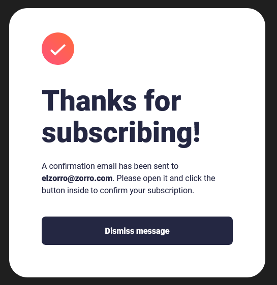
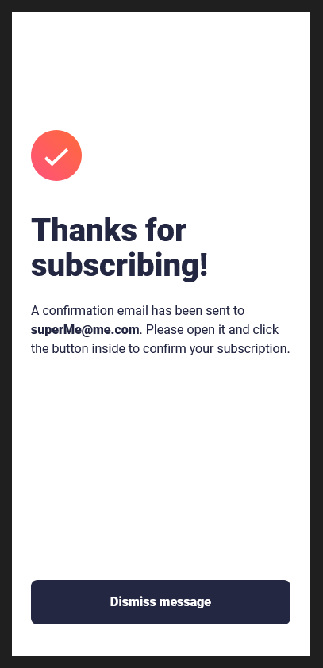

# Frontend Mentor - Newsletter sign-up form with success message solution

This is a solution to the [Newsletter sign-up form with success message challenge on Frontend Mentor](https://www.frontendmentor.io/challenges/newsletter-signup-form-with-success-message-3FC1AZbNrv). Frontend Mentor challenges help you improve your coding skills by building realistic projects. 

## Table of contents

- [Overview](#overview)
  - [The challenge](#the-challenge)
  - [Screenshot](#screenshot)
  - [Links](#links)
- [My process](#my-process)
  - [Built with](#built-with)
  - [What I learned](#what-i-learned)
  - [Continued development](#continued-development)
  - [Useful resources](#useful-resources)
- [Author](#author)


**Note: Delete this note and update the table of contents based on what sections you keep.**

## Overview

### The challenge

Users should be able to:

- Add their email and submit the form
- See a success message with their email after successfully submitting the form
- See form validation messages if:
  - The field is left empty
  - The email address is not formatted correctly
- View the optimal layout for the interface depending on their device's screen size
- See hover and focus states for all interactive elements on the page

### Screenshot







### Links

- Solution URL: [Github code](https://github.com/cacesasa/newsletter-signup)
- Live Site URL: [Live page URL - Github Pages](https://your-live-site-url.com)

## My process

### Built with

- Semantic HTML5 markup
- CSS custom properties
- Flexbox
- CSS Grid
- Mobile-first workflow
- Javascript


### What I learned

I learned how to use JS to validate a form.

To see how you can add code snippets, see below:

```js
const setError = (element, message) => {
    const inputControl = element.parentElement;
    const errorDisplay = inputControl.querySelector('.error');

    errorDisplay.innerText = message;
    inputControl.classList.add('error');
    inputControl.classList.remove('success');
}

const setSuccess = (element) => {
    const inputControl = element.parentElement;
    const errorDisplay = inputControl.querySelector('.error');

    errorDisplay.innerText = '';
    inputControl.classList.add('success');
    inputControl.classList.remove('error');
    
}
```

### Continued development

I want to keep working on my JS and React learning path.

### Useful resources

- [Client side form validation](https://developer.mozilla.org/en-US/docs/Learn/Forms/Form_validation) - This side showed me how to implement a simple way to validate forms using JS.


## Author

- Frontend Mentor - [@cacesasa](https://www.frontendmentor.io/profile/cacesasa)
- Twitter - [@cacesasa](https://www.twitter.com/cacesasa)

